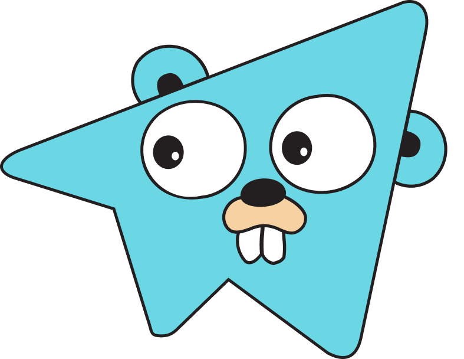

# Gogram  
 <!--   -->
> Telegram Bot Framework for Golang

Create incredibly fast Telegram bots in Go.

## TODO before v1
- [ ] Tests
- [ ] Options
- [ ] Webhook
- [ ] Comments to methods and structures
- [ ] README
- [ ] Github Pages
- [ ] Mark and text methods
- [ ] Payments, Passport, Games methods
- [ ] Edit message media
- [ ] Finish writing commented media methods
- [ ] Fix EditMessageMedia method

<!--TODO:
## Intro
- Describe very briefly but clearly what the project does.
- State if it is out-of-the-box user-friendly, so it’s clear to the user.
- List its most useful/innovative/noteworthy features.
- State its goals/what problem(s) it solves.
- Note and briefly describe any key concepts (technical, philosophical, or both) important to the user’s understanding.
- Link to any supplementary blog posts or project main pages.
- Note its development status.
- Include badges.
- If possible, include screenshots and demo videos.

## Core Technical Concepts/Inspiration

- Why does it exist?
- Frame your project for the potential user.
- Compare/contrast your project with other, similar projects so the user knows how it is different from those projects.
- Highlight the technical concepts that your project demonstrates or supports. Keep it very brief.
- Keep it useful.

## Getting Started/Requirements/Prerequisites/Dependencies
Include any essential instructions for:
- Getting it
- Installing It
- Configuring It
- Running it

## More Specific Topics (+ sample sub-categories)
- Versioning: Services, APIs, Systems
- Common Error Messages/related details
- Tests
- Is it a Swift project? Please take a look at Mattt Thompson & Nate Cook's [Swift documentation](http://nshipster.com/swift-documentation/) guide

## Contributing
- Contributor Guidelines
- Code Style/Requirements
- Format for commit messages
- Thank you (name contributors)

## TODO
- Next steps
- Features planned
- Known bugs (shortlist)

## Contact
- Email address
- Google Group/mailing list (if applicable)
- IRC or Slack (if applicable)

## License -->
